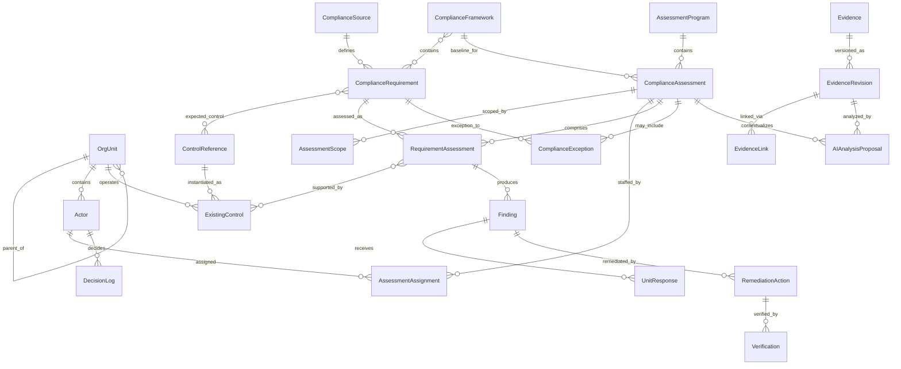

# Compliance Assessment App – Domain Model v0.1

**Trạng thái:** DRAFT BASELINE  
**Mục đích:** Xác định bộ object tối thiểu cần tồn tại trước khi thiết kế database/API/UI.  
**Reference:** CISO Assistant được dùng làm kiến trúc tham chiếu, không fork tại giai đoạn này.

---

## 1. Nguyên tắc thiết kế

1. `ComplianceRequirement` là yêu cầu tuân thủ gốc; `RequirementAssessment` là kết quả của yêu cầu đó trong một lần đánh giá cụ thể.
2. Không mô tả giới hạn phạm vi = đánh giá toàn bộ requirement có thể đánh giá trong framework.
3. Tiến độ đánh giá và kết quả tuân thủ là hai chiều dữ liệu độc lập.
4. `ExistingControl` và `RemediationAction` là hai object khác nhau.
5. Evidence là object độc lập, có revision; kết luận phải truy ngược được về đúng revision đã sử dụng.
6. Finding chính thức luôn phải có human confirmation; AI chỉ tạo proposal.
7. Assessment đã sign-off/lock không được chỉnh sửa ngầm.
8. Mọi thay đổi trọng yếu về scope, result, finding, action, exception phải có decision/audit trail.
9. RBAC áp dụng xuyên suốt dữ liệu, search, API và AI retrieval.
10. ERM không được tái tạo bên trong app Compliance; khi cần chỉ liên kết sang risk object/hệ thống ERM.

---

## 2. 22 object lõi

### A. Master Data — 7 object

| # | Object | Vai trò | Thuộc tính lõi đề xuất |
|---|---|---|---|
| 1 | **OrgUnit** | Cấu trúc tổ chức/phạm vi quản trị | id, code, name, type, parent_id, status |
| 2 | **Actor** | Chủ thể được giao vai trò: cá nhân/team/đơn vị | id, actor_type, name, org_unit_id, status |
| 3 | **ComplianceSource** | Nguồn tạo nghĩa vụ: luật, VBLQ, SOP, hợp đồng, tiêu chuẩn… | id, source_type, code, title, version, effective_from, effective_to, owner, supersedes_id |
| 4 | **ComplianceFramework** | Khung/bộ yêu cầu dùng cho đánh giá | id, code, name, version, status, owner, effective_from |
| 5 | **ComplianceRequirement** | Điểm/nghĩa vụ phải tuân thủ | id, code, title, description, source_id, source_clause, parent_id, assessable, mandatory_level, test_procedure, expected_evidence |
| 6 | **ControlReference** | Mẫu kiểm soát kỳ vọng/tham chiếu | id, code, name, description, control_type, frequency |
| 7 | **ExistingControl** | Kiểm soát thực tế đang vận hành tại một phạm vi | id, control_reference_id, org_unit_id, name, owner_actor_id, status, frequency, design_note |

### B. Transaction Data — 10 object

| # | Object | Vai trò | Thuộc tính lõi đề xuất |
|---|---|---|---|
| 8 | **AssessmentProgram** | Chương trình/kế hoạch kiểm tra gồm nhiều cuộc đánh giá | id, code, name, period, objective, owner_actor_id, status |
| 9 | **ComplianceAssessment** | Một cuộc kiểm tra/đánh giá cụ thể | id, program_id, framework_id, name, objective, period_from, period_to, status, result_summary, locked_at |
| 10 | **AssessmentScope** | Phạm vi đa chiều của assessment | id, assessment_id, org_unit_id, process_ref, location_ref, activity_ref, scope_note, include_all_requirements |
| 11 | **AssessmentAssignment** | Giao vai trò cho người tham gia assessment | id, assessment_id, actor_id, role, assigned_from, assigned_to |
| 12 | **RequirementAssessment** | Instance đánh giá từng requirement | id, assessment_id, requirement_id, workflow_status, compliance_result, finding_type, observation, assessed_by, assessed_at |
| 13 | **Finding** | Phát hiện chính thức | id, requirement_assessment_id, title, fact, criteria, gap, root_cause, risk_impact, severity, priority, status, confirmed_by, confirmed_at |
| 14 | **RemediationAction** | Hành động khắc phục/phòng ngừa | id, finding_id, action_type, action_text, owner_actor_id, due_date, status, progress, escalation_level |
| 15 | **Verification** | Xác minh hiệu lực/đóng action | id, action_id, verifier_actor_id, verification_date, result, note, next_review_date |
| 16 | **ComplianceException** | Ngoại lệ/waiver được phê duyệt | id, requirement_id, assessment_id, org_unit_id, justification, compensating_control, approver_actor_id, approved_at, expiry_date, status |
| 17 | **UnitResponse** | Phản hồi chính thức của đơn vị được đánh giá | id, finding_id, actor_id, response_type, response_text, submitted_at, assessor_disposition, disposition_note |

### C. Evidence Data — 3 object

| # | Object | Vai trò | Thuộc tính lõi đề xuất |
|---|---|---|---|
| 18 | **Evidence** | Danh tính logic của một bằng chứng | id, name, evidence_type, owner_actor_id, source_system, confidentiality, valid_from, valid_to, status |
| 19 | **EvidenceRevision** | Phiên bản bất biến của evidence | id, evidence_id, version, file_uri, original_filename, mime_type, sha256, captured_at, uploaded_by, observation |
| 20 | **EvidenceLink** | Liên kết một revision với đối tượng nghiệp vụ và mục đích sử dụng | id, evidence_revision_id, target_type, target_id, purpose, linked_by, linked_at |

### D. Governance Data — 2 object

| # | Object | Vai trò | Thuộc tính lõi đề xuất |
|---|---|---|---|
| 21 | **AIAnalysisProposal** | Kết quả AI chưa có hiệu lực chính thức | id, evidence_revision_id, assessment_id, proposed_requirement_id, proposed_result, proposed_finding, confidence, rationale, status, reviewed_by, reviewed_at |
| 22 | **DecisionLog** | Log quyết định/biến động trọng yếu có thể kiểm toán | id, object_type, object_id, decision_type, from_state, to_state, reason, decided_by, decided_at, approval_ref |

---

## 3. Quan hệ cardinality chính

| Quan hệ | Cardinality | Quy tắc |
|---|---|---|
| OrgUnit → OrgUnit | 1:N | Cấu trúc cha–con |
| OrgUnit → Actor | 1:N | Một actor có home unit; team/đơn vị vẫn biểu diễn qua actor_type |
| ComplianceSource → ComplianceRequirement | 1:N | Một nguồn có nhiều nghĩa vụ |
| ComplianceFramework ↔ ComplianceRequirement | N:N | Một requirement có thể tái sử dụng trong nhiều framework |
| ComplianceRequirement ↔ ControlReference | N:N | Một requirement có thể cần nhiều control; một control có thể đáp ứng nhiều requirement |
| ControlReference → ExistingControl | 1:N | Control tham chiếu có nhiều triển khai thực tế |
| OrgUnit → ExistingControl | 1:N | Kiểm soát thực tế thuộc phạm vi vận hành |
| AssessmentProgram → ComplianceAssessment | 1:N | Một chương trình có nhiều assessment |
| ComplianceFramework → ComplianceAssessment | 1:N | Một assessment dùng một framework baseline |
| ComplianceAssessment → AssessmentScope | 1:N | Scope đa chiều |
| ComplianceAssessment ↔ Actor | N:N qua AssessmentAssignment | Một assessment có nhiều vai trò/người tham gia |
| ComplianceAssessment → RequirementAssessment | 1:N | Sinh từ requirement trong framework/scope |
| ComplianceRequirement → RequirementAssessment | 1:N | Một requirement được đánh giá nhiều lần theo thời gian |
| RequirementAssessment ↔ ExistingControl | N:N | Ghi nhận control thực tế đang hỗ trợ requirement |
| RequirementAssessment → Finding | 1:N | Có thể không có hoặc có nhiều finding |
| Finding → UnitResponse | 1:N | Có thể có nhiều vòng phản hồi |
| Finding → RemediationAction | 1:N | Một finding có thể cần nhiều action |
| RemediationAction → Verification | 1:N | Cho phép nhiều vòng xác minh/re-open |
| ComplianceRequirement → ComplianceException | 1:N | Ngoại lệ phải gắn nghĩa vụ cụ thể |
| ComplianceAssessment → ComplianceException | 1:N (optional) | Ngoại lệ có thể phát sinh trong assessment |
| Evidence → EvidenceRevision | 1:N | Không overwrite revision cũ |
| EvidenceRevision → EvidenceLink | 1:N | Một revision có thể hỗ trợ nhiều object |
| EvidenceRevision → AIAnalysisProposal | 1:N | Có thể chạy lại AI theo model/prompt khác |
| ComplianceAssessment → AIAnalysisProposal | 1:N | Proposal luôn nằm trong context assessment |
| Mọi object trọng yếu → DecisionLog | 1:N logic | Dùng polymorphic object_type/object_id |

---

## 4. Quan hệ N:N cần junction table vật lý

Các junction table có thể không cần xuất hiện như domain object trên UI, nhưng **database bắt buộc phải có**:

1. `framework_requirements`
2. `requirement_control_references`
3. `requirement_assessment_existing_controls`

`AssessmentAssignment` và `EvidenceLink` được nâng thành domain object vì bản thân quan hệ có dữ liệu nghiệp vụ quan trọng.

---

## 5. ERD mức nghiệp vụ



---

## 6. Quy tắc tạo RequirementAssessment

Khi tạo `ComplianceAssessment`:

1. Lấy toàn bộ `ComplianceRequirement` thuộc `ComplianceFramework` và `assessable=true`.
2. Nếu `AssessmentScope.include_all_requirements=true` hoặc không có điều kiện giới hạn requirement → tạo RequirementAssessment cho toàn bộ requirement.
3. Nếu có scope/applicability filter → chỉ tạo các requirement đáp ứng rule.
4. Sau khi assessment bắt đầu, requirement set phải được **snapshot/versioned**; thay đổi framework không được âm thầm làm thay đổi cuộc đánh giá đang chạy.
5. Requirement ngoài scope phải có trace lý do loại trừ; không được chỉ xóa khỏi danh sách.

---

## 7. Quy tắc Finding

Một Finding chính thức bắt buộc:

- liên kết với `RequirementAssessment`;
- có ít nhất một `EvidenceLink` hoặc lý do rõ ràng nếu finding xuất phát từ observation/interview;
- tách riêng **Fact / Criteria / Gap / Risk-Impact**;
- có `confirmed_by` và `confirmed_at`;
- AI không được ghi trực tiếp Finding chính thức.

Finding và Recommendation không đồng nhất:
- Finding = có gap/điểm không phù hợp hoặc điểm yếu cần ghi nhận;
- Recommendation = nội dung đề xuất xử lý/cải tiến;
- remediation action = cam kết hành động đã được owner nhận thực hiện.

---

## 8. Quy tắc Evidence

1. File mới → tạo `EvidenceRevision` mới, không overwrite revision cũ.
2. Assessment/Requirement/Finding/Action/Verification phải trỏ tới revision đã dùng qua `EvidenceLink`.
3. Mỗi revision có SHA-256 để kiểm tra integrity.
4. Ảnh hiện trường cần giữ metadata nếu có: thời gian chụp, nguồn upload; vị trí chỉ lưu khi được phép và cần thiết.
5. Evidence bị hết hiệu lực không bị xóa; status chuyển expired/invalid nhưng lịch sử giữ nguyên.

---

## 9. Human-in-the-loop cho AI

```text
EvidenceRevision
      ↓
AIAnalysisProposal
      ↓
Proposed Requirement / Result / Finding
      ↓
Assessor Review
   ┌───────┴────────┐
 Accept           Reject
   ↓                ↓
Update draft      Keep log
   ↓
Human confirmation
   ↓
Official Result / Finding
```

Các trạng thái tối thiểu của `AIAnalysisProposal`:
- proposed
- accepted
- rejected
- superseded

Không dùng confidence score như quyết định tuân thủ; đây chỉ là thông tin hỗ trợ reviewer.

---

## 10. State model đề xuất

### ComplianceAssessment
`draft → approved_plan → fieldwork → unit_response → review → signed_off → closed`

Ngoại lệ:
- `reopened` chỉ qua quyết định có log.

### RequirementAssessment – workflow
`to_do → in_progress → in_review → done`

### RequirementAssessment – result
`not_assessed | compliant | partially_compliant | non_compliant | not_applicable | insufficient_evidence`

### Finding
`draft → confirmed → assigned → in_progress → pending_verification → closed`

Nhánh:
- dismissed
- reopened

### RemediationAction
`open → in_progress → submitted_for_verification → verified → closed`

Nhánh:
- overdue
- rejected
- reopened

---

## 11. Phân lớp dữ liệu

| Lớp dữ liệu | Object | Đặc tính |
|---|---|---|
| **Master Data** | OrgUnit, Actor, ComplianceSource, ComplianceFramework, ComplianceRequirement, ControlReference, ExistingControl | Tái sử dụng xuyên assessment; có owner/version/status |
| **Transaction Data** | AssessmentProgram, ComplianceAssessment, AssessmentScope, AssessmentAssignment, RequirementAssessment, Finding, RemediationAction, Verification, ComplianceException, UnitResponse | Phát sinh theo từng chương trình/cuộc kiểm tra |
| **Evidence Data** | Evidence, EvidenceRevision, EvidenceLink | Bằng chứng, provenance, revision, integrity |
| **Governance Data** | AIAnalysisProposal, DecisionLog | Kiểm soát AI, phê duyệt, thay đổi trạng thái, auditability |

---

## 12. Invariants bắt buộc trước khi code

1. Không được xóa vật lý assessment đã bắt đầu fieldwork; chỉ archive/deprecate.
2. RequirementAssessment đã `done` vẫn có thể có result = non_compliant.
3. Assessment progress không được tính từ compliance result.
4. Finding không tự sinh chính thức từ AI.
5. Action không được dùng thay ExistingControl.
6. Verification không được do chính owner action tự xác minh nếu rule kiểm soát yêu cầu độc lập.
7. Exception phải có expiry date và approver.
8. Signed-off assessment phải lock.
9. Evidence revision đã được dùng trong signed-off assessment phải immutable.
10. DecisionLog append-only.
11. RBAC phải kiểm soát cả dữ liệu trực tiếp lẫn dữ liệu đưa vào AI/RAG.
12. Framework update không hồi tố làm thay đổi assessment đã snapshot.

---

## 13. Các object chưa đưa vào v0.1

Chưa tách thành object riêng ở v0.1:
- TestProcedure — lưu trong ComplianceRequirement trước;
- Process/Location master — dùng reference trước, chỉ tách object khi tích hợp master data AgriS;
- Risk — chỉ link sang ERM, không tạo ERM thứ hai;
- KPI/KRI — để phase analytics/monitoring;
- Notification/Task — hạ tầng workflow, không phải domain lõi;
- Report/Export — projection từ transaction data;
- Dashboard — projection/analytics, không phải source-of-truth;
- AI model/prompt registry — platform configuration, không phải compliance domain.

---

## 14. Gate để chuyển sang schema/API v0.2

Chỉ chuyển sang database schema sau khi xác nhận 5 điểm:

1. Taxonomy chính thức của `ComplianceResult`.
2. Taxonomy `FindingType / Severity / Priority`.
3. Scope có cần thêm Process master và Location master ngay MVP hay không.
4. Mô hình phê duyệt/sign-off của Assessment và Finding.
5. Quy tắc độc lập của Verification đối với owner Action.
